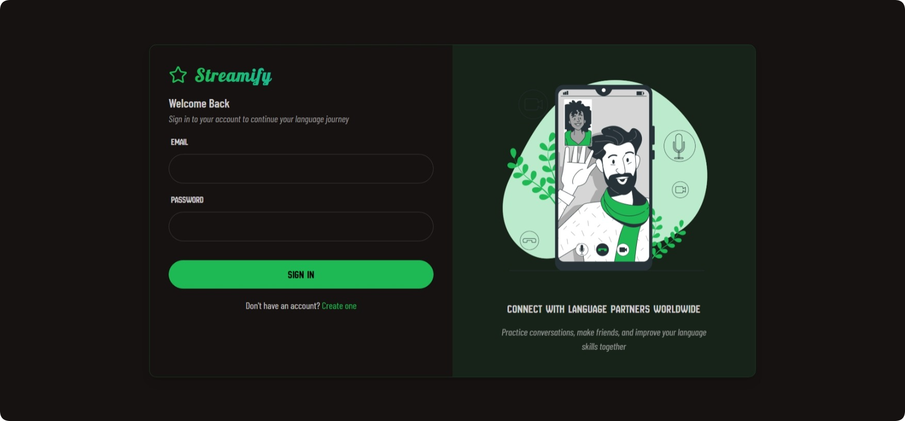

# STREAMIFY WEB APPLICATION



<p align="justify">
    <em>
        Streamify is a dedicated web platform that delivers a refined and engaging social experience, with a strong emphasis on real-time connection and authentic interaction. Designed to facilitate meaningful relationships, Streamify enables users to discover new connections, participate in seamless conversations, and initiate high-quality video calls with ease. Its elegant, intuitive interface and consistent performance across platforms ensure a smooth and enjoyable user journey. Whether you're meeting someone new or catching up with old friends, Streamify brings people together through instant messaging and live video, creating a vibrant, interactive environment for building genuine relationships.
    </em>
</p>

## 1. PROJECT

```
git clone https://github.com/BIN-PDT/WEBAPP_STREAMIFY.git && rm -rf WEBAPP_STREAMIFY/.git
```

_For privacy reasons, follow the format of `.env.example` and replace the sensitive information in `.env` with your own._

-   _Generate `SECRET_KEY` for backend_.

    ```
    openssl rand -hex 32
    ```

-   _Register MongoDB Atlas or MongoDB Compass to obtain `DATABASE_URI` for backend_.

-   _Register GetStream to obtain `API_KEY` & `API_SECRET` for backend and frontend_.

## 2. DEPENDENCY

```
npm install --prefix backend
```

```
npm install --prefix frontend
```

## 3. RUN APPLICATION

```
npm run dev --prefix backend
```

```
npm run dev --prefix frontend
```
